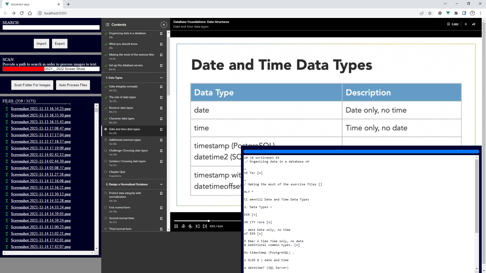

# tesseract-vue-app

This app scans the specified folder for images and performs OCR saving the text to local storage which is rendered with Vue.js.



This project was forked from the original [jeromewu/tesseract.js-vue-app](https://github.com/jeromewu/tesseract.js-vue-app) tesseract vue demo.

## Project setup

```
npm install
```

### Compiles and hot-reloads for development

```
npm run serve
```

### Compiles and minifies for production

```
npm run build
```

### Run your tests

```
npm run test
```

### Lints and fixes files

```
npm run lint
```

### Customize configuration

See [Configuration Reference](https://cli.vuejs.org/config/).
